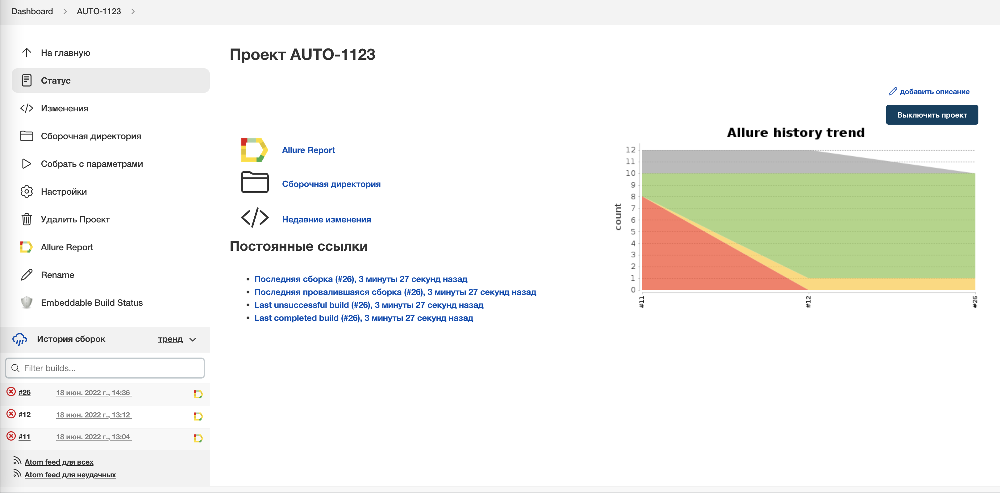
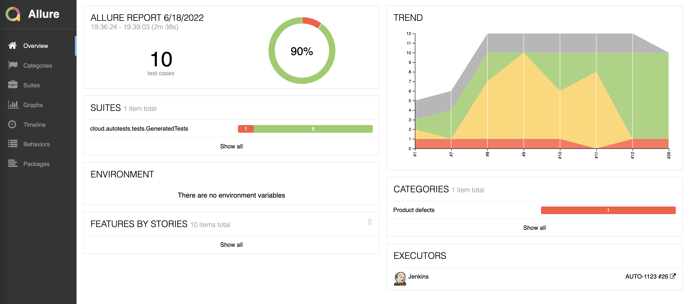
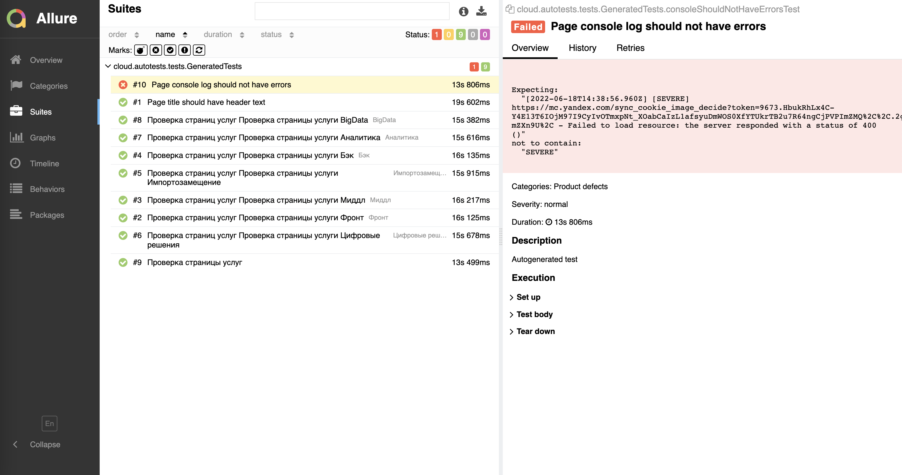
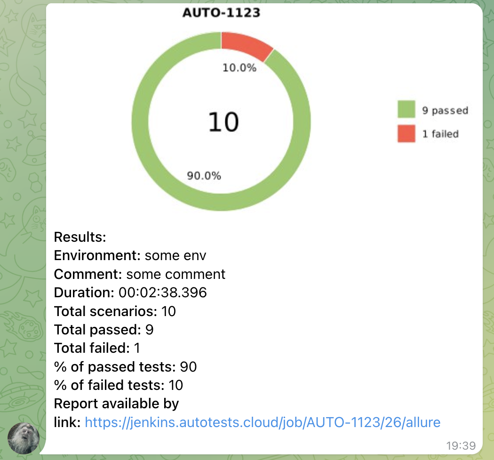
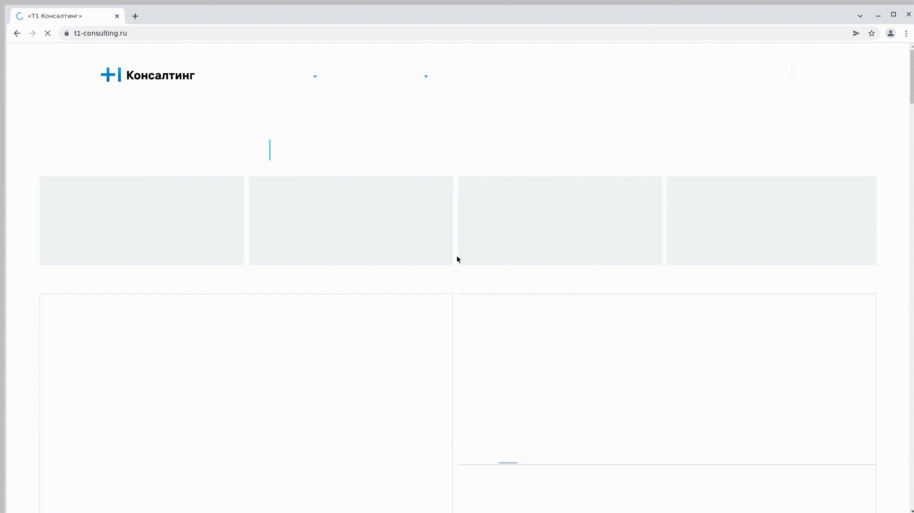

# Проект по автоматизации тестирования платформы "Т1 Консалтинг"
## <a target="_blank" href="https://www.t1-consulting.ru/">Платформа "Т1 Консалтинг"</a>

## :floppy_disk: Содержание:
- <a href="#computer-технологии-и-инструменты">Технологии и инструменты</a>
- <a href="#notebook_with_decorative_cover-реализованные-проверки">Реализованные проверки</a>
- <a href="#electric_plug-сборка-в-jenkins">Сборка в Jenkins</a>
- <a href="#arrow_forward-запуск-из-терминала">Запуск из терминала</a>
- <a href="#gear-запуск-тестов-с-выбором-параметров">Запуск тестов с выбором параметров</a>
- <a href="#open_book-allure-отчет">Allure отчет</a>
- <a href="#robot-отчет-в-telegram">Отчет в Telegram</a>
- <a href="#film_projector-видео-примеры-прохождения-тестов">Видео примеры прохождения тестов</a>

## :computer: Технологии и инструменты
<p align="center">


</p>

## :notebook_with_decorative_cover: Реализованные проверки
- Проверка страницы услуг
- Проверка страницы каждой услуги
- Проверка наличия ошибок в консоли
- Проверка корректности заголовка страницы

## :electric_plug: Сборка в Jenkins
### <a target="_blank" href="https://jenkins.autotests.cloud/job/AUTO-1123/">Сборка в Jenkins</a>
<p align="center">

</p>  

## :arrow_forward: Запуск из терминала
Локальный запуск:
```
gradle clean -DremoteDriverUrl=https://%s:%s@selenoid.autotests.cloud/wd/hub/ -DvideoStorage=https://selenoid.autotests.cloud/video/ -Dthreads=1 test
```
## :gear: Запуск тестов с выбором параметров 
For run remote tests need fill remote.properties or to pass value:
- baseUrl (default https://www.t1-consulting.ru)
- repository
- browser (default chrome)
- browserVersion (default 89.0)
- browserSize (default 1920x1080)
- remoteDriverUrl (url address from selenoid or grid)
- videoStorage (url address where you should get video)

Удаленный запуск:
```
clean
test
-Dbrowser=${BROWSER}
-DbrowserVersion=${BROWSER_VERSION}
-DbrowserSize=${BROWSER_SIZE}
-DbrowserMobileView="${BROWSER_MOBILE}"
-DremoteDriverUrl=https://${REMOTE_DRIVER_LOGIN}:${REMOTE_DRIVER_PASSWORD}@${REMOTE_DRIVER_URL}/wd/hub/
-DvideoStorage=https://${REMOTE_DRIVER_URL}/video/
```

## :open_book: Allure отчет
- ### Главный экран отчета
<p align="center">

</p>

- ### Страница с проведенными тестами
<p align="center">

</p>

## :robot: Отчет в Telegram
<p align="center">

</p>

## :film_projector: Видео примеры прохождения тестов
К каждому тесту в отчете прилагается видео. Одно из таких видео представлено ниже.
<p align="center">
  
</p>
